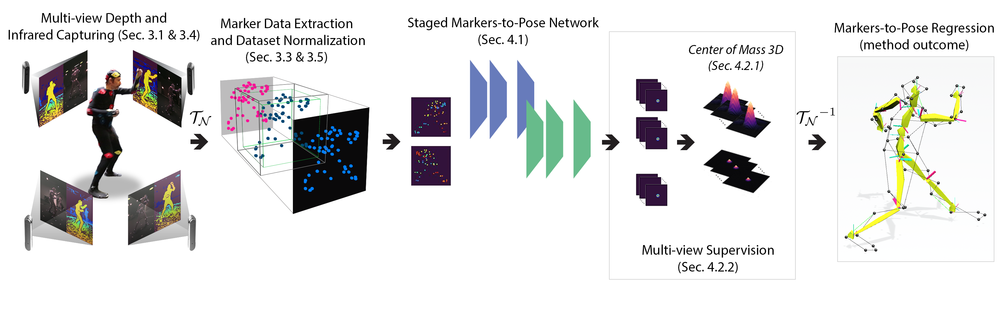

# DeMoCap: Low-cost Marker-based Motion Capture
Official implementation of "DeMoCap: Low-cost Marker-based Motion Capture" method. [](https://rdcu.be/czAXF)

[](https://link.springer.com/article/10.1007/s11263-021-01526-z)
[](https://www.python.org/)
[](http://tofis.github.io)


### Paper Abstract
Optical marker-based motion capture (MoCap) remains the predominant way to acquire high-fidelity articulated body motions. We introduce DeMoCap, the first data-driven approach for end-to-end marker-based MoCap, using only a sparse setup of spatio-temporally aligned, consumer-grade infrared-depth cameras. Trading off some of their typical features, our approach is the sole robust option for far lower-cost marker-based MoCap than high-end solutions. We introduce an end-to-end differentiable markers-to-pose model to solve a set of challenges such as under-constrained position estimates, noisy input data and spatial configuration invariance. We simultaneously handle depth and marker detection noise, label and localize the markers, and estimate the 3D pose by introducing a novel spatial 3D coordinate regression technique under a multi-view rendering and supervision concept. DeMoCap is driven by a special dataset captured with 4 spatio-temporally aligned low-cost Intel RealSense D415 sensors and a 24 MXT40S camera professional MoCap system, used as input and ground truth, respectively.


## Requirements
This code has been tested with:
- [PyTorch 1.10.2](https://pytorch.org/get-started/previous-versions/)
- [Python 3.8.11](https://www.python.org/downloads/release/python-3811/)
- [CUDA 11.3](https://developer.nvidia.com/cuda-11-3-1-download-archive)

Besides PyTorch, the following Python packages are needed:
- [moai](https://pypi.org/project/moai-mdk/)
- [opencv-python](https://pypi.org/project/opencv-python/)
- [numpy](https://numpy.org/)
- [matplotlib](https://matplotlib.org/)
- [torchvision](https://pypi.org/project/torchvision/)
- [visdom](https://github.com/facebookresearch/visdom)

## Dataset

You can download [here](https://drive.google.com/file/d/1R0nqyBaKPp5wfJ0LH4hekUNrq4e3kodt/view?usp=sharing) the data used for training, validation and testing of DeMoCap.
For accessing the data, a google drive request with a message confirming the consent with the data license (CC-BY-4.0) is mandatory. You will receive the decryption pass via email after that.

## Installation

The code is powered by [moai-mdk](https://pypi.org/project/moai-mdk/) framework enabling the building of the model on a configuration-based implementation along with custom extra modules. 
For further details with respect to the framework and the way it should be installed for running the code, please visit the [documentation](https://moai.readthedocs.io/en/latest/) of the framework.

After the succesfull installation of the requirements, from the root folder of the project, run the code below:

```
moai train democap\democap_HRNET_2_views_fp\democap_official.yaml --config-dir conf H4DIR_train_split={your_train_folder} H4DIR_test_split={your_test_folder} H4DIR_val_split={your_val_folder} +project_path=[{project_path_root}]
```
------

If you used the method or found this work useful, please cite:
```
@article{chatzitofis2021democap,
  title={DeMoCap: Low-Cost Marker-Based Motion Capture},
  author={Chatzitofis, Anargyros and Zarpalas, Dimitrios and Daras, Petros and Kollias, Stefanos},
  journal={International Journal of Computer Vision},
  volume={129},
  number={12},
  pages={3338--3366},
  year={2021},
  publisher={Springer}
}
```
